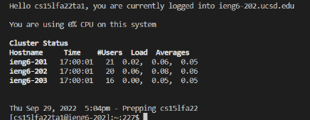

**Hail, traveler.**  
I see you are looking for information regarding remote connections in **CSE 15L**  
Allow me to be of assistance.  
  
  **Step 1**
First and foremost, lets make sure you're situated with **Visual Studio Code,** or **VS Code** for short.  
Follow this link here [VS Code Download](https://code.visualstudio.com/) to download and get things setup on your computer.  
Once opening it and following the given prompts, you should come across a screen that looks like this:  
  
  
**Step 2**  
Once you've got VS Code situated, lets use it to connect to the 15l servers remotely.  
In VS Code, navigate towards the top bar with drop down menus until you find yourself at the one called **termnial**  
Click on it and then click on the option **New termianl*  
Once doing this, the terminal should appear on the bottom half of the screen.  
To login to the remote server, type the following command into the terminal  
  
  **ssh cse15lfa22zz@ieng6.ucsd.edu**  
    
replacing the **"zz"** with the two letters in your given username.  
After doing so, you should be prompted with terminal messages that look similar to this:  
  
  
This will be the indication that you have successfully logged in to the remote server.  
  
**Step 3**  
Now, we are going to attempt to try a few commands. There is a list of commands that you can try including:  
-cd ~  
-cd  
-ls -lat  
-ls -a  
-ls <directory> (with the directory being **/home/linux/ieng6/cs15lfa22/cs15lfa22abc** where "abc" is one of the other group member's username  
-cp /home/linux/ieng6/cs15lfa22/public/hello.txt ~/  
-cat /home/linux/ieng6/cs15lfa22/public/hello.txt  
    
 The command that I chose to use is **ls -lat** which producing a result like this, listing files in the directory laterally  
  
