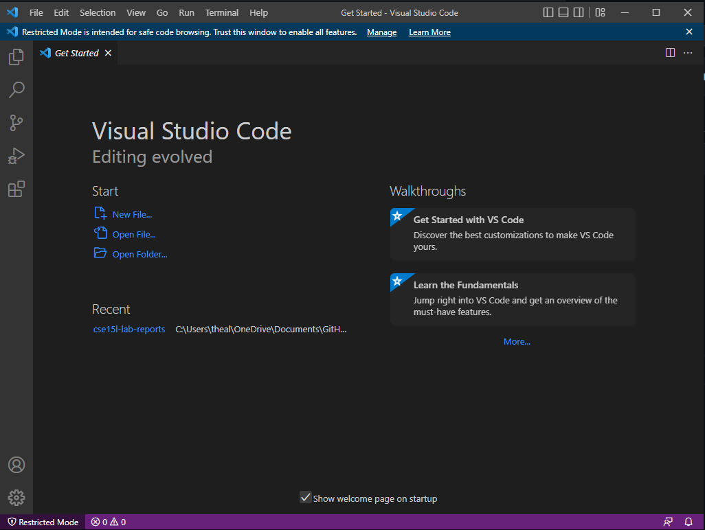

**Hail, traveler.**  
I see you are looking for information regarding remote connections in **CSE 15L**  
Allow me to be of assistance.  
  
  **Step 1**
First and foremost, lets make sure you're situated with **Visual Studio Code,** or **VS Code** for short.  
Follow this link here [VS Code Download](https://code.visualstudio.com/) to download and get things setup on your computer.  
Once opening it and following the given prompts, you should come across a screen that looks like this:  

