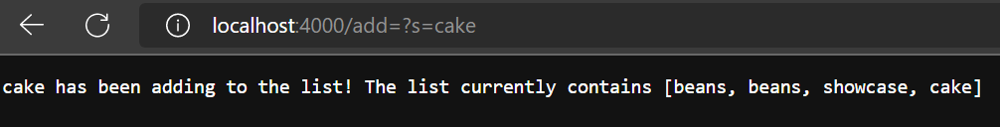
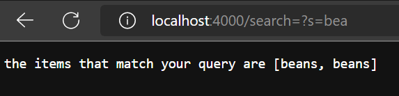
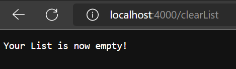
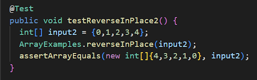
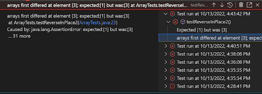
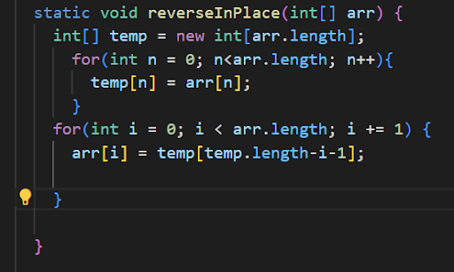
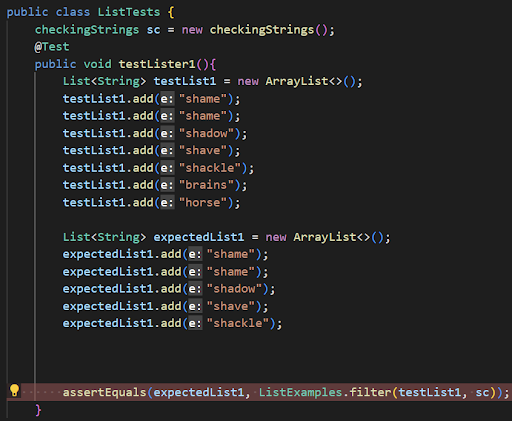
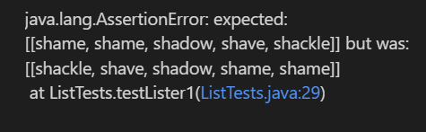
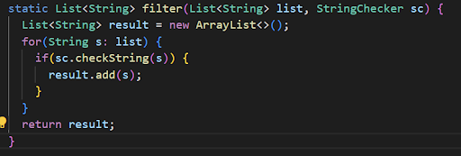

```
import java.io.IOException;
import java.net.URI;
import java.util.ArrayList;

class searchHandler implements URLHandler {

    ArrayList<String> strList = new ArrayList<String>(); 

    public String handleRequest(URI url) {
        if (url.getPath().equals("/")) {
            return String.format("No more numbers");
        } else if (url.getPath().equals("/clearList")) {

            strList.clear();
            return String.format("Your List is now empty!");
            
        } else {
            System.out.println("Path: " + url.getPath());
            if (url.getPath().contains("/add")) {
                String[] parameters = url.getQuery().split("=");
                if (parameters[0].equals("s")) {
                    strList.add(parameters[1]);
                    return String.format("%s has been adding to the list! The list currently contains %s", parameters[1], strList);
                }
            }
            if (url.getPath().contains("/search")) {
                ArrayList<String> correctQuery = new ArrayList<String>();
                
                String[] parameters = url.getQuery().split("=");
                if (parameters[0].equals("s")){
                    for (int n=0; n<strList.size(); n++){
                        if((strList.get(n)).contains(parameters[1])){
                            correctQuery.add(strList.get(n));
                        }
                    }
                    return String.format("the items that match your query are %s", correctQuery);
                }
            }
            return "404 Not Found!";
        }
    }
}

`class SearchEngine {
    public static void main(String[] args) throws IOException {
        if(args.length == 0){
            System.out.println("Missing port number! Try any number between 1024 to 49151");
            return;
        }

        int port = Integer.parseInt(args[0]);

        Server.start(port, new searchHandler());
    }
}
```  
  
  Here is the first part of the search engine, the **add** function, which calls upon the part of the searchHandler class that begins with  
  **if (url.getPath().contains("/add"))**  
    
  The url.getQuery().split("=") portion of the code grants us the information after the = sign to figure out what String is to be added.  
  In this case, that would be the word **cake**  
  If you were to change cake to another word (like beans), that would be the next thing added to the list, and then displayed!  
    
  For the second part of the search engine, the **search** function, which begins with  
  **if (url.getPath().contains("/search"))**  
    
  Similarly to the add function, we use **split** to get the information being queried  
  Here, we are searching for the sequence "bea" in the strings we have in our list.  
  With our list currently holding "beans", "beans", "showcase", and "cake", the only 2 words with "bea" would be both variants of beans  
  If we were to change our search query to something like "ca", then cake would show up.  
    
  The final implementation is one that I added for fun! A way to clear the list without rebooting the server!  
  This is found in the section of the code that shows  
  **else if (url.getPath().equals("/clearList"))**  
    
  This identifies if you type in "clearList" after the url, and serves to clear your list and give a nice little message!  
  This only works properly if "clearList" is typed in properly or else you'll be delivered a 404 error!  
    
    
    
  **Now lets talk about bugs!**  
  ReverseInPlace Method:  
  Failure Inducing Test:  
    
  Symptom:  
    
  Fixed Code:  
    
    
  The issue with the initial code was that the array was referencing itself when attempting to change itself.  
  Because of this, once it got halfway through, the original values were no longer there to be referenced.  
    
  Filter Method:  
  Failure Inducing Test:  
    
  Symptom:  
    
  Fixed Code:  
    
    
  The issue with this segment of code was that the resulting array of strings was ordered backwards.  
  In order to fix this, new strings were added to the end of the array, instead of the beginning.
