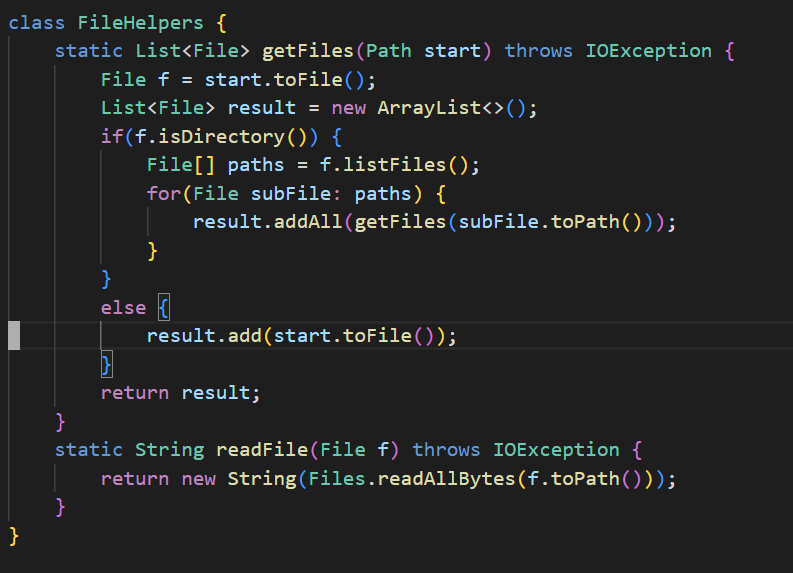
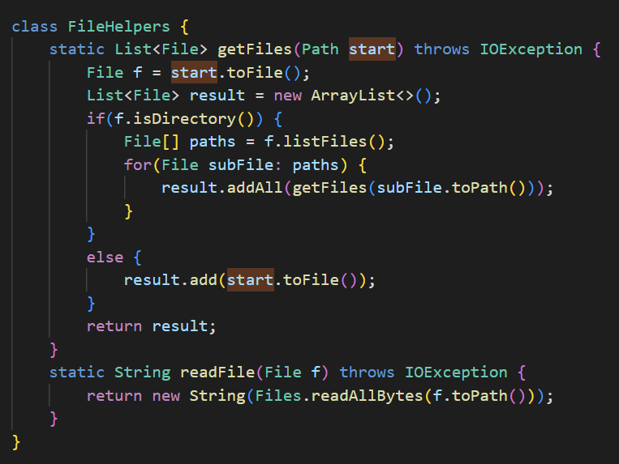
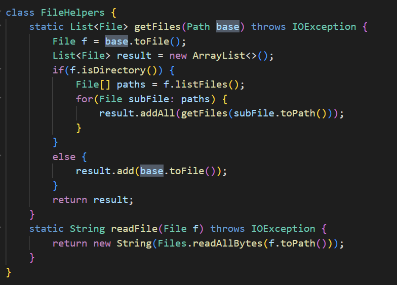
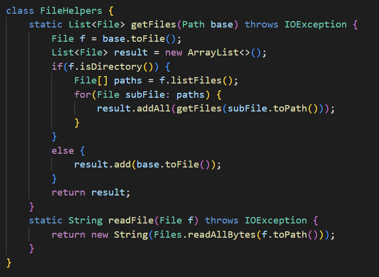

The shortest set of commands needed to replace all the variations of "start" with the word "base" is:  
:%s/start/base/g

The base segment of code starts off looking like this:  
  
  
 After pressing colon, typing %s/ and then typing start in a manner that results in this:  
   
   
 You'll end up with a highlight appearing around all of the instances of that word "start" in the file:  
   
   
 Then, afteter typing /base after "start", as you type it each letter, it will delete all iterations of "start"  
 and begin to type out the word you are currently typing, in this case "base"  
   
   
   
   
 Finally, finish out the command with /g and press enter, committing all of the changes:  
   
    

 
