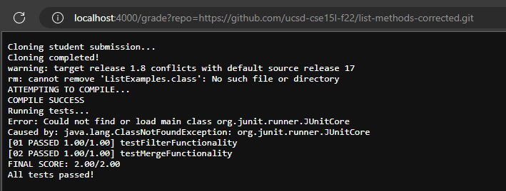
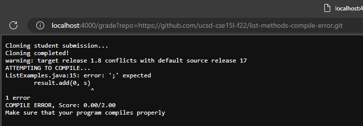
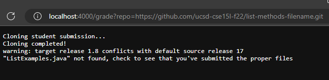

```# Create your grading script here


rm -rf student-submission
echo "Cloning student submission..."
git clone $1 student-submission 2> /dev/null
echo "Cloning completed!"
error=0
javac -target 1.8 -cp ".;..lib/hamcrest-core-1.3.jar:lib/junit-4.13.2.jar" ListExamples.java TestListExamples.java
rm ListExamples.class
CP="..;../lib/hamcrest-core-1.3.jar:../lib/junit-4.13.2.jar"
cd student-submission

ls -a > fileList.txt
if [ $(grep -c "ListExamples.java" fileList.txt) -eq 0 ]
then
    echo "\"ListExamples.java\" not found, check to see that you've submitted the proper files"
    exit 1
fi

echo "ATTEMPTING TO COMPILE..."
javac -cp $CP *.java

if [ $? -ne 0 ]
then
    echo "COMPILE ERROR, Score: 0.00/2.00"
    echo "Make sure that your program compiles properly"
    exit 1
fi

echo "COMPILE SUCCESS"
echo "Running tests..."
cp ListExamples.class ..
java -cp $CP org.junit.runner.JUnitCore TestListExamples > error.txt
cp ../ListExamples.class .
if [ $(grep -c "testFilter" error.txt) -ne 0 ]
then
    let "error+=1"
    echo "[01 FAILED 0.00/1.00] testFilterFunctionality"
else
    echo "[01 PASSED 1.00/1.00] testFilterFunctionality"
fi

if [ $(grep -c "testMerge" error.txt) -ne 0 ]
then
    let "error+=1"
    echo "[02 FAILED 0.00/1.00] testMergeFunctionality"
else
    echo "[02 PASSED 1.00/1.00] testMergeFunctionality"
fi

if [ $error -eq 2 ]
then
    echo "FINAL SCORE: 0.00/2.00"
    echo "See error.txt file in student-submission for details"
fi

if [ $error -eq 1 ]
then
    echo "FINAL SCORE: 1.00/2.00"
    echo "See error.txt file in student-submission for details"
fi

if [ $error -eq 0 ]
then
    echo "FINAL SCORE: 2.00/2.00"
    echo "All tests passed!"
fi

```   
  
  
  
  
  
  
For our trace, we will be examining the second screenshot, analyzing the case of a **COMPILE ERROR**  
Following our code:  
-rm -rf student-submission <--- Attempts to remove any current student-submission. Return code: 0
echo "Cloning into student submission" <--- Output: "Cloning into student submission" Error: "" Return code:0  
git clone $1 student-submission 2> /dev/null <--- Return code: 0
echo "Cloning completed!"  <--- Output: "Cloning completed" Return code: 0
error=0  
javac -target 1.8 -cp ".;..lib/hamcrest-core-1.3.jar:lib/junit-4.13.2.jar" ListExamples.java TestListExamples.java <--- Return code:0 
rm ListExamples.class   
  CP="..;../lib/hamcrest-core-1.3.jar:../lib/junit-4.13.2.jar"  
cd student-submission
  
ls -a > fileList.txt  
if [ $(grep -c "ListExamples.java" fileList.txt) -eq 0 ]  <--- Condition is false since file "ListExamples.java" was found| Return code:0
then  
    echo "\"ListExamples.java\" not found, check to see that you've submitted the proper files"  <--- Not run since if is false  
    exit 1  <--- Not run since if is false  
fi  

echo "ATTEMPTING TO COMPILE..."  <--- Output: "ATTEMPTING TO COMPILE..." Return code: 0  
javac -cp $CP *.java <--- Compiles files ending with .java, fails to compile and prints error Return code: 1  
if [ $? -ne 0 ] <-- Return code is currently 1 so does not equal 0 therefore this evaluates to true since 1 != 0   
then <-- Runs since if was true  
    echo "COMPILE ERROR, Score: 0.00/2.00" <--- Output: "COMPILE ERROR, Score: 0.00/2.00"  
    echo "Make sure that your program compiles properly" <--- Output: "Make sure that your program compiles properly"  
    exit 1 <-- Script exits with exit code 1  
fi  
Since our script exited with this if statement, the code that comes after will not run.
